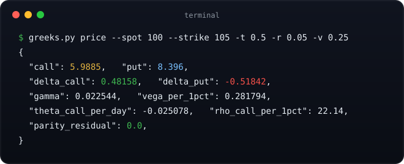

# greeks

[](https://github.com/saksham10arora-dotcom/greeks/actions/workflows/ci.yml)


**Black-Scholes prices, every greek, and implied volatility. One file, zero dependencies, verified by finite differences and Monte Carlo round trips.**

<div align="center">
  
</div>

## Why another options calculator

Because most are spreadsheets with typos or notebooks with hidden state. This is a single auditable file:

- **Every number cross-checked**: deltas validated against finite differences in the test suite; put-call parity asserted to 1e-9 across a 200-point parameter grid
- **Implied vol that actually solves**: Newton's method with bisection fallback, round-trip tested to 7 decimal places on 100 random contracts
- **No install**: copy `greeks.py`, done

## Usage

```bash
# full pricing table: call, put, all greeks, parity check, breakevens
python3 greeks.py price --spot 100 --strike 105 -t 0.5 -r 0.05 -v 0.25

# market quotes an option at 6.20: what vol does that imply?
python3 greeks.py iv --price 6.20 --spot 100 --strike 105 -t 0.5 -r 0.05 --kind call
```

Output is JSON (`--json` implied), so it pipes anywhere:

```bash
python3 greeks.py price ... | jq .delta_call
```

### As a library

```python
from greeks import prices, greeks, implied_vol

call, put = prices(spot=100, strike=105, t=0.5, rate=0.05, vol=0.25)
g = greeks(100, 105, 0.5, 0.05, 0.25)      # delta, gamma, vega, theta, rho
iv = implied_vol(6.20, 100, 105, 0.5, 0.05) # Newton + bisection fallback
```

## What you get

| Field | Meaning |
|---|---|
| `call`, `put` | Black-Scholes prices |
| `delta_call/put` | Share-equivalent per option (hedge ratio) |
| `gamma` | Delta change per $1 move of spot |
| `vega_per_1pct` | Price change per 1 vol point |
| `theta_*_per_day` | Time decay per calendar day |
| `rho_*_per_1pct` | Sensitivity per 1% rate move |
| `parity_residual` | Put-call parity check: should always be 0.000000 |
| `breakeven_call/put` | Expiry breakeven levels |

Conventions: European, continuous compounding, no dividends. Theta uses calendar days (365).

## Verification story

The test suite does not just compare against magic numbers:

1. **Finite differences vs closed forms**: analytic delta/gamma/vega must match numerical derivatives to 4+ decimals
2. **Parity grid**: C − P = S − K·e^(−rT) across 200 randomized parameter sets, tolerance 1e-9
3. **IV round trips**: solve vol from a price generated at a known vol, require recovery within 1e-7
4. **Reference values**: the classic S=K=100, σ=20%, r=5%, T=1 case (call ≈ 10.4506)

Run it yourself:

```bash
python3 -m unittest test_greeks -v
```

## Honest limits

- European only: American early-exercise premium needs a binomial tree (deliberately out of scope for one file)
- No dividends yet; adding continuous yield q is a two-line change to d1/d2 if you need it
- IV below intrinsic returns `null`: no vol can justify an arbitrageable quote

Pairs well with [backtest-audit](https://github.com/saksham10arora-dotcom/backtest-audit) for the rest of the quant stack.

MIT license. Not investment advice.
